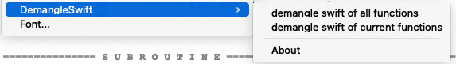
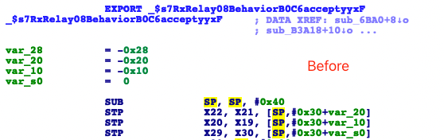
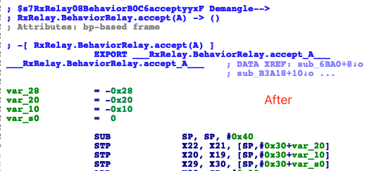

# ida-swift-demangle

This is an IDA script to demangle Swift functions. It currently only works for ELF files. PRs are welcome for supporting
other formats.

The swift-demangle binary file is required. This command is required after xcode is installed on Mac. Windows needs to
move the.dll and.exe files in the project to the same directory as the plug-in

Currently, only macOS and Windows 64-bit are supported, and only MacOS-IDA7.0 is successfully tested. Other platforms
need to test the availability by themselves

## Usage

1. Download entire folder `ida-swift-demangle`
2. if system is macOS need move `ida_swift_demangle.py` to `IDA Pro 7.0/ida.app/Contents/MacOS/plugins/`， if system is
   Windows need to move all the files
3. Convert current function: `Right button -> DemangleSwift -> demangle swift of current functions`
4. Convert all function: `Right button -> DemangleSwift -> demangle swift of all functions`

usage

before

after

## About

This project borrows heavily from other scripts or plugins on the web (listed below),
Fixed the problem that calling subprocess.Open will cause IDA plug-in to suspend or flash back, and added new features
to support right-clicking to run (a few lines of code is not difficult), the following is a reference project, thank you
for open source!

1. [tobefuturer/ida-swift-demangle](https://github.com/tobefuturer/ida-swift-demangle)
2. [gsingh93/ida-swift-demangle](https://github.com/gsingh93/ida-swift-demangle)
3. [keystone-engine/keypatch](https://github.com/keystone-engine/keypatch)
